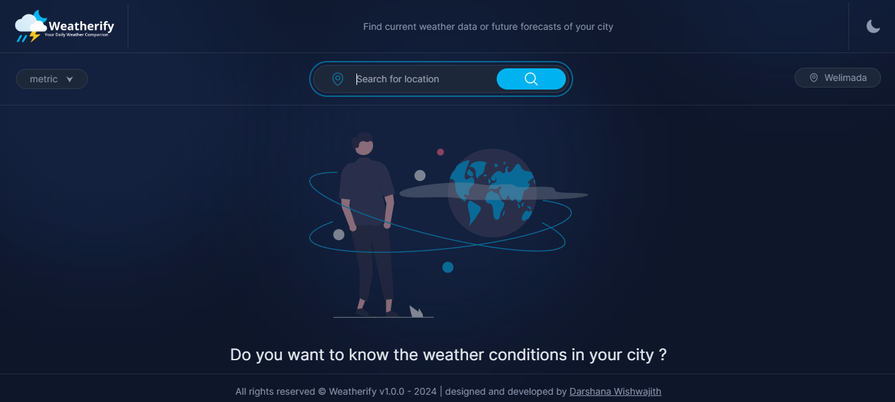
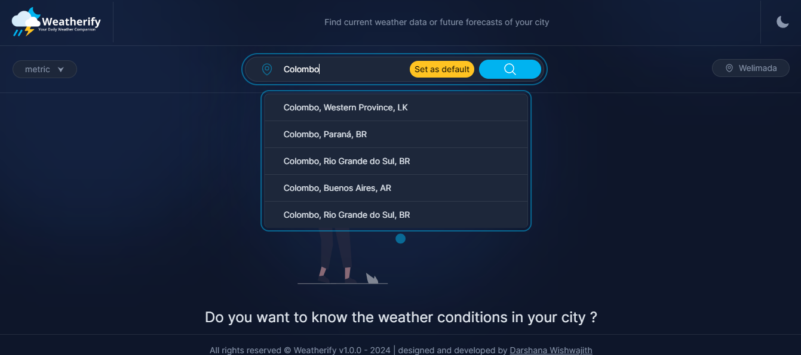
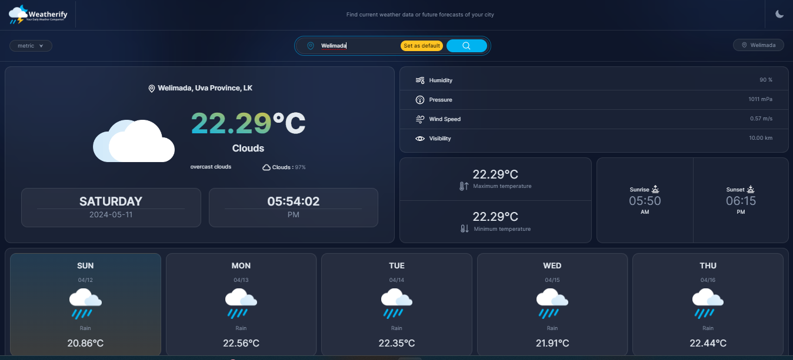
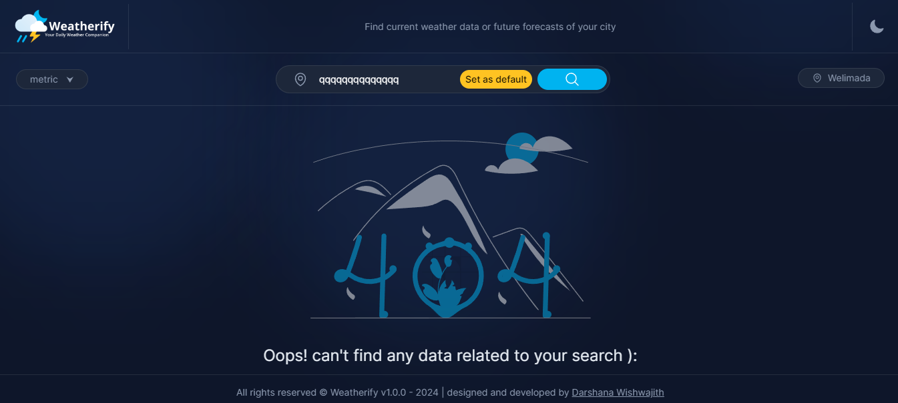

# Weatherify v1.0.0

Weatherify is a simple weather application built using HTML, CSS, and JavaScript. It utilizes the Tailwind CSS framework for styling and fetches weather data from the OpenWeather API.

## Features
- View current weather conditions for any location
- Detailed weather information including temperature, humidity, and wind speed
- Seamless experience on desktop

## Screenshots

## Installation
1. Clone the repository: `git@github.com:darshana-wishwajith/Weatherify.git`
2. Open `index.html` in your web browser

## Usage
1. Enter the name of the city you want to check the weather for
2. Press the "Search" button
3. View the current weather conditions

## Credits
- Weather data provided by [OpenWeather](https://openweathermap.org/weather-conditions)

## License
This project is licensed under the MIT License - see the [LICENSE](LICENSE) file for details.
